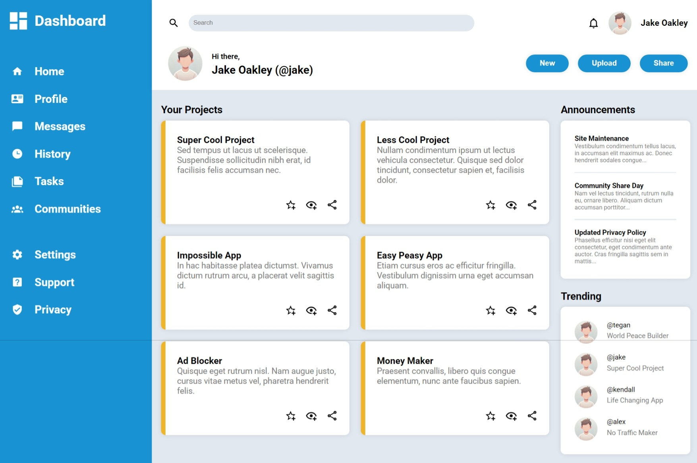

# Admin Dashboard Project

This is an **Admin Dashboard** project created as part of [The Odin Project](https://www.theodinproject.com/) Intermediate HTML and CSS curriculum. The project focuses on applying advanced CSS techniques to design a visually appealing and responsive admin dashboard layout.

## Features

- **CSS Grid** is used to structure the layout, including:
  - Sidebar navigation.
  - Main content area.
  - Widgets and additional sections.
- Consistent design with modern UI principles.
- Organized and reusable CSS for easy maintenance and scalability.

## Project Preview



Try the live version of the project here: [Live Preview](https://gonalgar.github.io/admin-dashboard/)

## Technologies Used

- **HTML5**: Semantic structure for dashboard layout.
- **CSS3**: Advanced styling and layout design using CSS Grid and Flexbox.
- **Responsive Design**: Ensuring a seamless experience on different devices.

## Getting Started

To view or modify the project locally:

1. Clone this repository:
   ```bash
   git clone https://github.com/gonalgar/admin-dashboard.git
2. Navigate to the project directory:
    ```bash
    cd admin-dashboard
3. Open the index.html file in your browser to view the dashboard.

## What I Learned
- Using CSS Grid to create complex and flexible layouts.
- Combining Flexbox and Grid for specific design needs.
- Designing responsive layouts for various screen sizes.
- Improving code organization with reusable CSS classes.

## Acknowledgements
This project is part of [The Odin Project Intermediate HTML and CSS](https://www.theodinproject.com/paths/full-stack-javascript/courses/intermediate-html-and-css) curriculum. It provided hands-on experience with advanced layout techniques.

## License
This project is open-source and available under the MIT License.